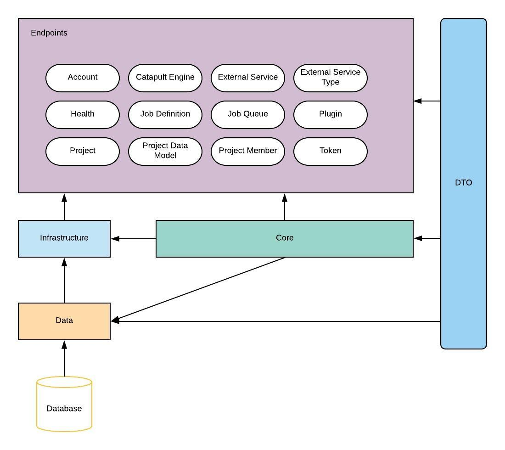

# API

## Architecture

## Endpoints
The following sections explain the details for each endpoints
- [Account](account.md)
- [Catapult Engine](catapult-engine.md)
- [External Service](external-service.md)
- [External Service Type](external-service-type.md)
- [Health](health.md)
- [Job Definition](job-definition.md)
- [Job Queue](job-queue.md)
- [Plugin](plugin.md)
- [Project](Project.md)
- [Project Data Model](project-data-model.md)
- [Project Member](project-member.md)
- [Token](token.md)

## Endpoint Authorization
Each endpoint could define the needed authorization in order to access them. Following are the authorizations available in the API:
- `ProjectAccess`: The user is a member in the current project, regardless of its role
- `ProjectOwnerAccess`: The user is a member with `Owner` role in the current project
- `ProjectMaintainerAccess`: The user is a member with `Maintainer` or higher role in the current project
- `ProjectContributorAccess`: The user is a member with `Contributor` or higher role in the current project
- `ProjectMemberAccess`: The user is a member in the current project
- `UserRoleAdminAccess`: The user have an `Administrator` user role
- `UserRoleBasicAccess`: The user have `Basic` user role or higher
- `UserRoleGuestAccess`: The user have `Guest` user role or higher
- `UserRoleEngineAccess`: The endpoint can only be invoked by catapult engine
- `Authenticated`: The request to the API require any authenticated user
- `Anonymous`: The endpoint does not require authentication

## Further Reference
A more detailed documentation about each endpoints request and response is available within API's swagger page. Simply open the API base url in the browser to navigate the the swagger page.