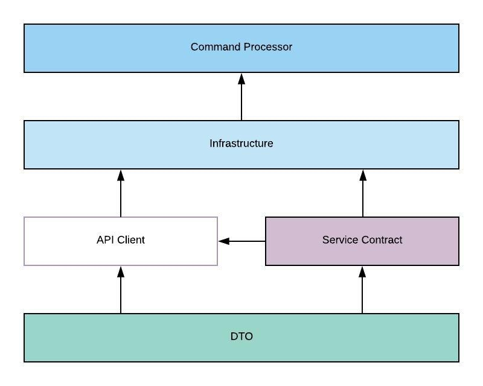

# Command Line Interface

`Opencatapult` provides command line interface as a way for user to interact with the system. In most of the time, it will make API calls and display back the result based on the API response. So it is important to make sure that the right API Url has been set in the config.

## Architecture



## Commands

Following are the available commands in CLI:

### Login
Login to `OpenCatapult`. You will be prompted to input the user's password.

Usage:
```sh
dotnet occli.dll login --user [user]
```

| Option | Alias | Description | Allowed Values | DefaultValue | Mandatory |
| --- | --- | --- | --- | --- | --- |
| --user | -u | Username of the suspended user ||| Yes |

### Logout
Logout from `OpenCatapult`.

Usage:
```sh
dotnet occli.dll logout
```

### Current User
Check current logged-in user.

Usage:
```sh
dotnet occli.dll currentuser
```

### Version
Check version of the components

Usage:
```sh
dotnet occli.dll version
```

### Account		
User account related commands			

#### Subcommands

* [Activate](account.md#activate)
* [List](account.md#list)
* [Register](account.md#register)
* [Remove](account.md#remove)
* [Suspend](account.md#suspend)
* [Update](account.md#update)
* [SetRole](account.md#setrole)
* [Password Update](account.md#password-update)
* [Password ResetToken](account.md#password-resettoken)
* [Password Reset](account.md#password-reset)

### Config		
CLI Configurations

Usage: 
```sh
dotnet occli.dll config [subcommands]
```

#### Subcommands

* [get](config.md#get)
* [import](config.md#import)
* [remove](config.md#remove)
* [set](config.md#set)

### Engine		
Catapult engine registration commands

Usage: 
```sh
dotnet occli.dll engine [subcommands]
```

#### Subcommands

* [activate](engine.md#activate)
* [get](engine.md#get)
* [list](engine.md#list)
* [register](engine.md#register)
* [remove](engine.md#remove)
* [suspend](engine.md#suspend)
* [token](engine.md#token)

### Job		
Job Definition related commands

Usage: 
```sh
dotnet occli.dll job [subcommands]
```

#### Subcommands

* [add](job.md#add)
* [get](job.md#get)
* [list](job.md#list)
* [remove](job.md#remove)
* [update](job.md#update)

### Member		
Project member related commands

Usage: 
```sh
dotnet occli.dll member [subcommands]
```

#### Subcommands

* [add](member.md#add)
* [list](member.md#list)
* [remove](member.md#remove)
* [update](member.md#update)

### Model		
Project Data Model related commands

Usage: 
```sh
dotnet occli.dll model [subcommands]
```

#### Subcommands

* [add](model.md#add)
* [get](model.md#get)
* [list](model.md#list)
* [remove](model.md#remove)
* [update](model.md#update)

### Provider		
Task provider registration commands

Usage: 
```sh
dotnet occli.dll provider [subcommands]
```

#### Subcommands

* [get](provider.md#get)
* [list](provider.md#list)
* [register](provider.md#register)
* [remove](provider.md#remove)

### Project		
Project related commands

Usage: 
```sh
dotnet occli.dll project [subcommands]
```

#### Subcommands

* [archive](project.md#archive)
* [clone](project.md#clone)
* [create](project.md#create)
* [export](project.md#export)
* [get](project.md#get)
* [list](project.md#list)
* [remove](project.md#remove)
* [restore](project.md#restore)
* [update](project.md#update)

### Property		
Project Data Model Property related commands

Usage: 
```sh
dotnet occli.dll property [subcommands]
```

#### Subcommands

* [add](property.md#add)
* [list](property.md#list)
* [remove](property.md#remove)
* [update](property.md#update)

### Queue		
Job Queue related commands

Usage: 
```sh
dotnet occli.dll queue [subcommands]
```

#### Subcommands

* [add](queue.md#add)
* [get](queue.md#get)
* [list](queue.md#list)
* [log](queue.md#log)
* [restart](queue.md#restart)

### Service		
External service related commands

Usage: 
```sh
dotnet occli.dll service [subcommands]
```

#### Subcommands

* [add](service.md#add)
* [get](service.md#get)
* [list](service.md#list)
* [remove](service.md#remove)
* [update](service.md#update)

### Task		
Job Task Definitions related commands

Usage: 
```sh
dotnet occli.dll task [subcommands]
```

#### Subcommands

* [add](task.md#add)
* [get](task.md#get)
* [list](task.md#list)
* [remove](task.md#remove)
* [update](task.md#update)

### Version		
Get the versions of opencatapult components: CLI, API, engines, and task providers

Usage: 
```sh
dotnet occli.dll version
```