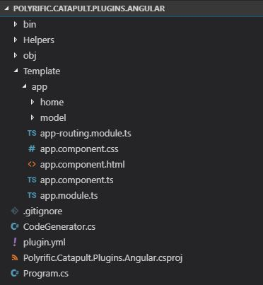

# Create a task provider - Part 2 (Generate model components)

In part 1, we have created a simple generator provider. The generated code will be static since it only call the `ng new` command to create an angular project skeleton. In this tutorial we will expand the code generation logic so that it creates angular component for each `Models` that is available in the `CodeGeneratorProvider` base class. This way, user can create/update the models, and the changes will be reflected on the code generated by our provider.

> You can find the code in this tutorial in our GitHub repository: https://github.com/Polyrific-Inc/Polyrific.Catapult.TaskProviders.Angular/tree/tutorial-part-2

## Create Helper classes
Our `Program` class would get too big if we put all of the code generation logic in there. So it'd be wise to separate some logic into different classes. Though you can actually put all of the logic inside the `Program.cs`, it'd not be too maintainable once the code generation logic get more complex.

First we'd need a helper Class to  run Angular CLI commands. In the previous part, we directly call the `ProcessStartInfo` inside our code generator method. But we'll be calling several CLI commands, so it'd be wise to have a separate helper method that will run the angular cli commands. 

Create a folder `Helpers` and create a class `CommandHelper.cs` inside of it. The CommandHelper static class will have a static method named `ExecuteShellCommand` that execute a shell command along with its arguments.

```csharp
using System;
using System.Collections.Generic;
using System.Diagnostics;
using System.Runtime.InteropServices;
using System.Text;
using System.Threading.Tasks;
using Microsoft.Extensions.Logging;

namespace MyCodeGenerator.Helpers
{
    public static class CommandHelper
    {
        public static async Task<string> ExecuteShellCommand(string command, string workingDirectory, ILogger logger = null)
        {
            var outputBuilder = new StringBuilder();
            var errorBuilder = new StringBuilder();
            var error = "";

            string fileName;

            // we cannot start the node module in ProcessStartInfo, so we will use powershell
            if (RuntimeInformation.IsOSPlatform(OSPlatform.Windows)) 
            {
                fileName = "powershell";
            }
            else 
            {
                fileName = "pwsh";
                command = $"-c \"{command}\"";
            }

            var info = new ProcessStartInfo(fileName)
            {
                UseShellExecute = false,
                Arguments = command,
                RedirectStandardInput = true,
                RedirectStandardOutput = true,
                RedirectStandardError = true,
                CreateNoWindow = true,
                WorkingDirectory = workingDirectory
            };

            using (var process = Process.Start(info))
            {
                if (process != null)
                {
                    var reader = process.StandardOutput;
                    while (!reader.EndOfStream)
                    {
                        var line = await reader.ReadLineAsync();

                        logger?.LogDebug(line);

                        outputBuilder.AppendLine(line);
                    }

                    var errorReader = process.StandardError;
                    while (!errorReader.EndOfStream)
                    {
                        var line = await errorReader.ReadLineAsync();

                        if (line.StartsWith("npm WARN"))
                        {
                            logger?.LogWarning(line);
                        }
                        else if (!string.IsNullOrEmpty(line))
                        {
                            errorBuilder.AppendLine(line);
                        }
                    }

                    error = errorBuilder.ToString();
                }
            }

            if (!string.IsNullOrEmpty(error))
                throw new Exception(error);

            return outputBuilder.ToString();
        }
    }
}
```
Aside from running the command and returning the result, it would also log any output of the command into the logger class.

Now we can create the class that will do most of the heavy lifting, we shall create a class called `CodeGenerator`, that exposes 1 public method, `Generate`. 
```csharp
using System;
using System.Collections.Generic;
using System.IO;
using System.Reflection;
using System.Text;
using System.Threading.Tasks;
using Humanizer;
using Microsoft.Extensions.Logging;
using Polyrific.Catapult.TaskProviders.Angular.Helpers;
using Polyrific.Catapult.Shared.Dto.Constants;
using Polyrific.Catapult.Shared.Dto.ProjectDataModel;

namespace Polyrific.Catapult.TaskProviders.Angular
{
    public class CodeGenerator
    {
        private readonly ILogger _logger;

        private static string AssemblyDirectory
        {
            get
            {
                string codeBase = Assembly.GetExecutingAssembly().CodeBase;
                var uri = new UriBuilder(codeBase);
                string path = Uri.UnescapeDataString(uri.Path);
                return Path.GetDirectoryName(path);
            }
        }

        public CodeGenerator(ILogger logger)
        {
            _logger = logger;
        }

        public async Task<string> Generate(string projectName, string projectTitle, string outputLocation, List<ProjectDataModelDto> models)
        {
            try
            {
                // clean project name form space
                projectName = projectName.Replace(" ", "").Kebaberize();
                var projectFolder = Path.Combine(outputLocation, projectName);

                // 1. Generate the project
                await CreateAngularProject(projectName, outputLocation);
                await InitializeProject(projectFolder);

                // 2. Generate each model files
                await CreateHomeComponent(projectFolder, projectTitle, models);
                foreach (var model in models)
                {
                    await CreateModelRelatedFile(projectFolder, model);
                }

                return "";
            }
            catch (Exception ex)
            {
                _logger.LogError(ex, ex.Message);
                return ex.Message;
            }
        }

        private async Task CreateAngularProject(string projectName, string outputLocation)
        {
            await CommandHelper.ExecuteNodeModule($"ng new {projectName} --routing=true --skipGit=true", outputLocation, _logger);
        }

        private async Task InitializeProject(string projectFolder)
        {
            // install angular material to project
            await CommandHelper.ExecuteNodeModule($"ng add @angular/material", projectFolder, _logger);
        }

        private async Task CreateHomeComponent(string projectFolder, string projectTitle, List<ProjectDataModelDto> models)
        {
            var appFolder = Path.Combine(projectFolder, "src/app");
            
            if (File.Exists(Path.Combine(appFolder, "app.component.ts")))
            {
                var content = await LoadFile(Path.Combine(AssemblyDirectory, "Template/app", "app.component.ts"));
                content = content.Replace("$Title$", projectTitle);
                await File.WriteAllTextAsync(Path.Combine(appFolder, "app.component.ts"), content);
            }
            
            if (File.Exists(Path.Combine(appFolder, "app.component.css")))
            {
                var content = await LoadFile(Path.Combine(AssemblyDirectory, "Template/app", "app.component.css"));
                await File.WriteAllTextAsync(Path.Combine(appFolder, "app.component.css"), content);
            }

            if (File.Exists(Path.Combine(appFolder, "app.component.html")))
            {
                var content = await LoadFile(Path.Combine(AssemblyDirectory, "Template/app", "app.component.html"));

                var sb = new StringBuilder();
                foreach (var model in models)
                {
                    sb.AppendLine($"<a mat-list-item routerLink=\"/{model.Name.Kebaberize()}\">{model.Label}</a>");
                }
                content = content.Replace("$navlist$", sb.ToString());

                await File.WriteAllTextAsync(Path.Combine(appFolder, "app.component.html"), content);
            }
            
            
            if (File.Exists(Path.Combine(appFolder, "app.module.ts")))
            {
                var content = await LoadFile(Path.Combine(AssemblyDirectory, "Template/app", "app.module.ts"));
                await File.WriteAllTextAsync(Path.Combine(appFolder, "app.module.ts"), content);
            }

            if (File.Exists(Path.Combine(appFolder, "app-routing.module.ts")))
            {
                var content = await LoadFile(Path.Combine(AssemblyDirectory, "Template/app", "app-routing.module.ts"));

                var sb = new StringBuilder();
                foreach (var model in models)
                {
                    var modelName = model.Name.Kebaberize();
                    sb.AppendLine($"import {{ {model.Name}Component }} from './{modelName}/{modelName}.component';");
                }
                
                content = content.Replace("$ImportComponents$", sb.ToString());
                
                sb = new StringBuilder();
                foreach (var model in models)
                {
                    var modelName = model.Name.Kebaberize();
                    sb.AppendLine($"{{path: '{modelName}', component: {model.Name}Component }},");
                }
                
                content = content.Replace("$RouteComponents$", sb.ToString());

                await File.WriteAllTextAsync(Path.Combine(appFolder, "app-routing.module.ts"), content);
            }

            
            await CommandHelper.ExecuteNodeModule($"ng generate component home", projectFolder, _logger);
            
            if (File.Exists(Path.Combine(appFolder, "home", "home.component.html")))
            {
                var content = await LoadFile(Path.Combine(AssemblyDirectory, "Template/app/home", "home.component.html"));
                await File.WriteAllTextAsync(Path.Combine(appFolder, "home", "home.component.html"), content);
            }
        }

        private async Task CreateModelRelatedFile(string projectFolder, ProjectDataModelDto model)
        {
            await CreateModelComponent(projectFolder, model);

            await CreateModelDataSource(projectFolder, model);
        }

        private async Task CreateModelComponent(string projectFolder, ProjectDataModelDto model)
        {
            var modelName = model.Name.Kebaberize();
            await CommandHelper.ExecuteNodeModule($"ng generate component {modelName}", projectFolder, _logger);

            string componentFolder = Path.Combine(projectFolder, "src/app", modelName);
            if (File.Exists(Path.Combine(componentFolder, $"{modelName}.component.ts")))
            {
                var content = await LoadFile(Path.Combine(AssemblyDirectory, "Template/app/model", "model.component.ts"));

                content = content.Replace("$ModelName$", modelName);
                content = content.Replace("$ModelClassName$", model.Name);
                
                var sb = new StringBuilder();
                foreach (var property in model.Properties)
                {
                    var propertyName = property.Name.Camelize();
                    sb.Append($"'{propertyName}', ");
                }

                content = content.Replace("$PropertyList$", sb.ToString());

                await File.WriteAllTextAsync(Path.Combine(componentFolder, $"{modelName}.component.ts"), content);
            }
            
            if (File.Exists(Path.Combine(componentFolder, $"{modelName}.component.css")))
            {
                var content = await LoadFile(Path.Combine(AssemblyDirectory, "Template/app/model", "model.component.css"));
                await File.WriteAllTextAsync(Path.Combine(componentFolder, $"{modelName}.component.css"), content);
            }

            if (File.Exists(Path.Combine(componentFolder, $"{modelName}.component.html")))
            {
                var content = await LoadFile(Path.Combine(AssemblyDirectory, "Template/app/model", "model.component.html"));

                var sb = new StringBuilder();
                foreach (var property in model.Properties)
                {
                    var propertyName = property.Name.Camelize();
                    sb.AppendLine($"<!-- {property.Name} column -->");
                    sb.AppendLine($"<ng-container matColumnDef=\"{propertyName}\">");
                    sb.AppendLine($"<th mat-header-cell *matHeaderCellDef mat-sort-header>{property.Label}</th>");
                    sb.AppendLine($"<td mat-cell *matCellDef=\"let row\">{{{{row.{propertyName}}}}}</td>");
                    sb.AppendLine("</ng-container>");
                }
                content = content.Replace("$ColumnDefinition$", sb.ToString());

                await File.WriteAllTextAsync(Path.Combine(componentFolder, $"{modelName}.component.html"), content);
            }
        }

        private async Task CreateModelDataSource(string projectFolder, ProjectDataModelDto model)
        {
            var modelName = model.Name.Kebaberize();
            var componentFolder = Path.Combine(projectFolder, "src/app", modelName);
            var content = await LoadFile(Path.Combine(AssemblyDirectory, "Template/app/model", "model-datasource.ts"));

            var sb = new StringBuilder();
            foreach (var property in model.Properties)
            {
                var propertyName = property.Name.Camelize();

                string propertyType;
                switch (property.DataType)
                {
                    case PropertyDataType.String:
                        propertyType = "string";
                        break;
                    case PropertyDataType.Integer:
                    case PropertyDataType.Short:
                    case PropertyDataType.Float:
                    case PropertyDataType.Decimal:
                    case PropertyDataType.Double:
                        propertyType = "number";
                        break;
                    case PropertyDataType.Boolean:
                        propertyType = "boolean";
                        break;
                    default:
                        propertyType = "any";
                        break;
                }
                sb.AppendLine($"{propertyName}: {propertyType};");
            }
            
            content = content.Replace("$ModelDefinition$", sb.ToString());
            
            sb = new StringBuilder();
            for (var i = 0; i < 10; i++)
            {
                sb.Append("{");
                foreach (var property in model.Properties)
                {
                    var propertyName = property.Name.Camelize();
                    sb.Append($"{propertyName}: {GetRandomData(property.DataType)}, ");
                }

                sb.Append("},");
                sb.AppendLine();
            }
            
            content = content.Replace("$ModelDummyData$", sb.ToString());

            sb = new StringBuilder();
            sb.AppendLine("switch (this.sort.active) {");
            foreach (var property in model.Properties)
            {
                var propertyName = property.Name.Camelize();
                switch (property.DataType)
                {
                    case PropertyDataType.Boolean:
                    case PropertyDataType.String:
                        sb.AppendLine($"case '{propertyName}': return compare(a.{propertyName}, b.{propertyName}, isAsc);");
                        break;
                    case PropertyDataType.Integer:
                    case PropertyDataType.Short:
                    case PropertyDataType.Float:
                    case PropertyDataType.Decimal:
                    case PropertyDataType.Double:
                        sb.AppendLine($"case '{propertyName}': return compare(+a.{propertyName}, +b.{propertyName}, isAsc);");
                        break;
                    default:
                        break;
                }
            }
            sb.AppendLine("default: return 0;");
            sb.AppendLine("}");
            content = content.Replace("$ModelSort$", sb.ToString());
            
            content = content.Replace("$ModelName$", model.Name);

            await File.WriteAllTextAsync(Path.Combine(componentFolder, $"{modelName}-datasource.ts"), content);
        }

        private async Task<string> LoadFile(string filePath)
        {
            var content = await File.ReadAllTextAsync(filePath);

            content = content.Replace("// @ts-ignore", "");

            return content;
        }

        private string GetRandomData(string propertyType)
        {            
            var rand = new Random();
            switch (propertyType)
            {
                case PropertyDataType.Integer:
                case PropertyDataType.Short:
                case PropertyDataType.Float:
                case PropertyDataType.Decimal:
                case PropertyDataType.Double:
                    return rand.Next(10).ToString();
                case PropertyDataType.Boolean:
                    return (rand.NextDouble() >= 0.5) ? "true" : "false";
                default:
                    return $"\"dummy {rand.Next(10)}\"";
            }
        }
    }
}
```

The code above basically do four things:
- Create the angular project using `ng new`
- Add Material UI library using `ng add`
- Add angular components for each model using `ng generate component`
- Modify the generated components based on the model's property

## Provide model template
To modify the generated components based on the model's property, we'd need to add some template files in our project. Please download the following [zip file ](../file/Template.zip), and put it into your project. The folder structure should like this:




## Call the CodeGenerator in Program.cs
The last thing is to call the `CodeGenerator` in the `Program.cs`. The generate method will return an error message if exists. If there's an error message, we should return it at the third tupple item.
```csharp
var error = await _codeGenerator.Generate(ProjectName, projectTitle, Config.OutputLocation, Models);

if (!string.IsNullOrEmpty(error))
    return ("", null, error);
```


Here's how the `Program.cs` should look now:
```csharp
using System;
using System.Collections.Generic;
using System.IO;
using System.Runtime.CompilerServices;
using System.Threading.Tasks;
using Humanizer;
using Polyrific.Catapult.TaskProviders.Core;

namespace Polyrific.Catapult.TaskProviders.Angular
{
    class Program : CodeGeneratorProvider
    {
        private readonly CodeGenerator _codeGenerator;

        public Program(string[] args) : base(args)
        {
            _codeGenerator = new CodeGenerator(Logger);
        }

        public override string Name => "Polyrific.Catapult.TaskProviders.Angular";

        static async Task Main(string[] args)
        {
            var app = new Program(args);
            
            var result = await app.Execute();
            app.ReturnOutput(result);
        }

        public override async Task<(string outputLocation, Dictionary<string, string> outputValues, string errorMessage)> Generate()
        {
            string projectTitle = ProjectName.Humanize(); // set the default title to project name
            if (AdditionalConfigs != null && AdditionalConfigs.ContainsKey("Title") && !string.IsNullOrEmpty(AdditionalConfigs["Title"]))
                projectTitle = AdditionalConfigs["Title"];
            
            Config.OutputLocation = Config.OutputLocation ?? Config.WorkingLocation;

            var error = await _codeGenerator.Generate(ProjectName, projectTitle, Config.OutputLocation, Models);

            if (!string.IsNullOrEmpty(error))
                return ("", null, error);

            return (Config.OutputLocation, null, "");        
        }
    }
}

```

## Summary
We have created a code generator provider that would generate code based on the models supplied in opencatapult. The generated code will change each time the model is changed. This make it easier in our development when we need to add a new feature and required to add new models. We only need to modify the model structure in opencatapult, run our code generation task, and the new components will be created for us. 

Now, let see our generator in action in [Part 3](./create-task-provider-3.md)