# Quick Start

This document will guide you to get started with `OpenCatapult`.

The easiest way to get started and use `OpenCatapult` is by utilizing the released package. At the moment it is only available for Windows x64 platform. We have been planning to release the package for other platforms (Linux or Mac) as well in the future.

If you want to try `OpenCatapult` in the platforms other than Windows now, you could always build it yourself from the source code which you can get from our [GitHub repository](https://github.com/Polyrific-Inc/OpenCatapult). This [guide](../dev-guides/build-code.md) might be useful if you want to do it.

## Prerequisites

The main `OpenCatapult` components require **.NET Core 2.2 runtime** installed on your machine. However, in this tutorial you will also need **.NET Core 2.2 SDK** because you will generate an ASP.NET Core MVC application later by using some `.NET CLI` commands.

If you don't have the SDK, please get the installer from the [.NET download page](https://dotnet.microsoft.com/download). Please note that installing SDK will also include the runtime, so you don't have to install them twice.

After installing .NET Core, please make sure it is correctly installed on your machine by typing this command in a Command Prompt:

```
dotnet --info
```

If you get something like the screenshot below, it means you are good to go.

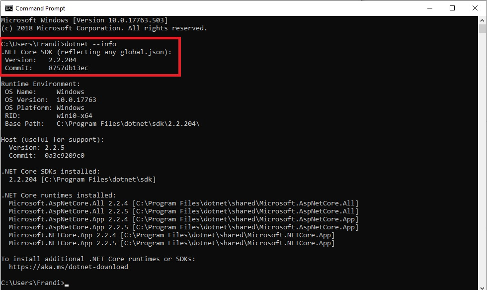

## Get the installer package

Please go to [OpenCatapult release website](https://releases.opencatapult.net) and download the installer package which is available in the `All Components` box.

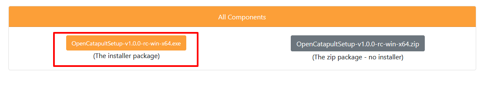

## Install the package

After downloading the installer package, just double click it and follow the following instructions:
1) If the "Windows Defender Smartscreen" window pops up, just click "More Info" and "Run Anyway" buttons

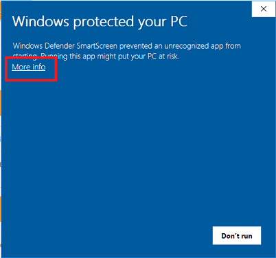
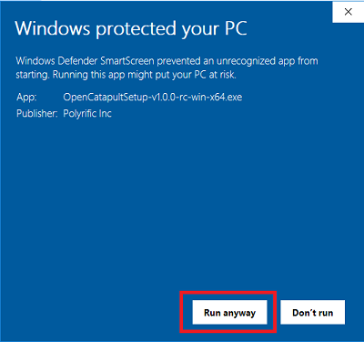

2) When the "User Access Control" window pops up, clik "Yes" button

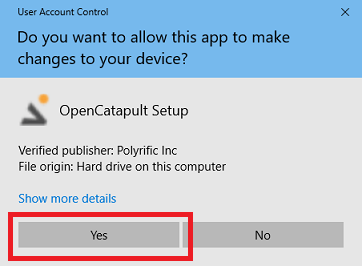

3) Select where OpenCatapult components should be installed, then click "Next" button

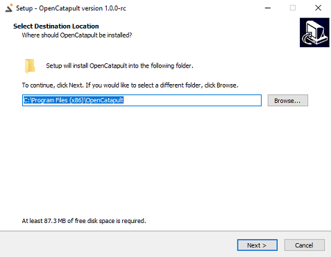

4) Give the Start Menu folder a name, then click "Next" button

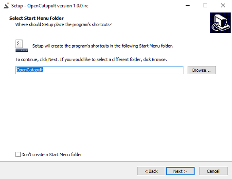

5) Select the "Create a desktop shortcut" checkbox, then click "Next" button

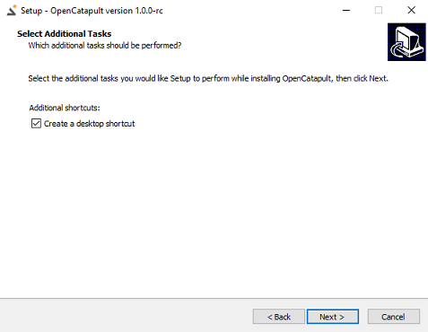

6) Review the installation summary, then click "Install" button

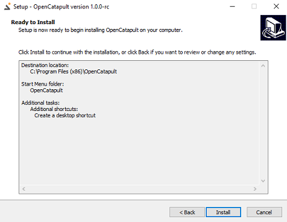

7) Wait until the installation complete, then click "Finish" button

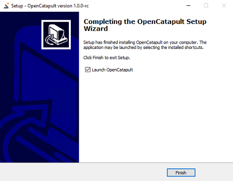

## Run the components

Please follow these steps to run the `OpenCatapult` components:

1) If the `OpenCatapult Manager` window has been opened, please close it first. Then find the shortcut either in Desktop or Start Menu, right click it, and select "`Run as administrator`". Click "Yes" on the confirmation.

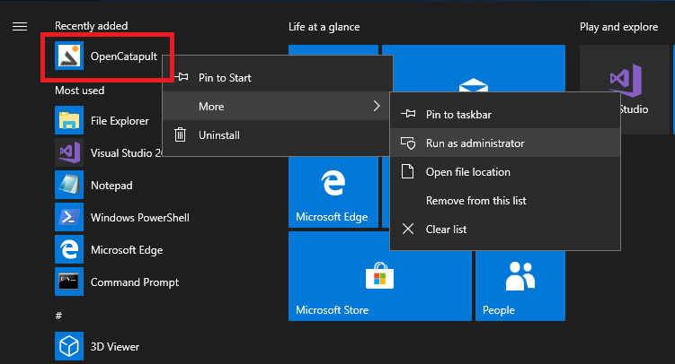
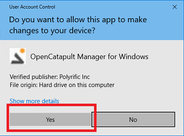

2) Let's start the API component first by clicking "Start" button in the `OpenCatapult Manager`

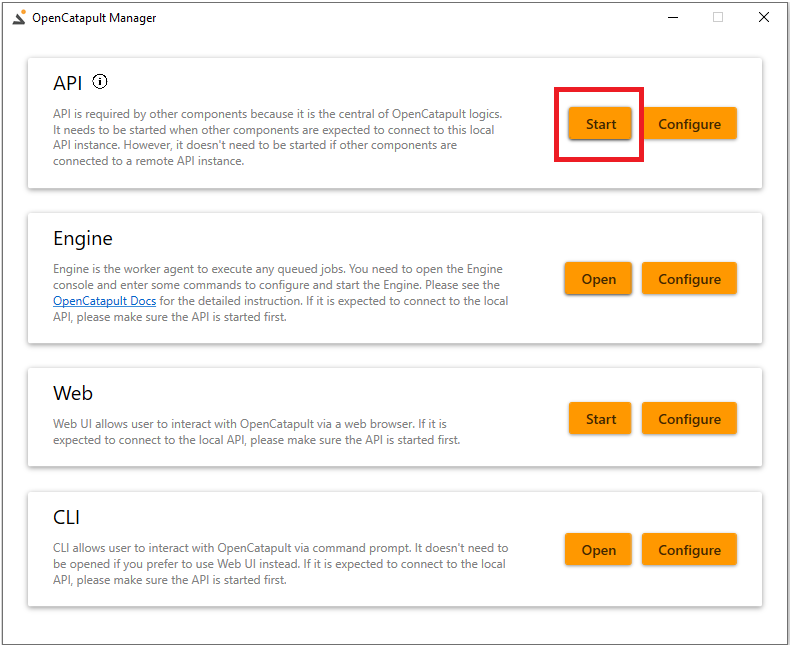

Notice that a command prompt is opened. Please wait until the running script is completed. If you see the following status, it means the API has been successfully started on https://localhost:44305

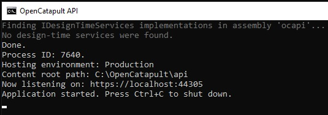

3) Let's get back to the `OpenCatapult Manager` again. Click on the Web's Start button to start the Web component

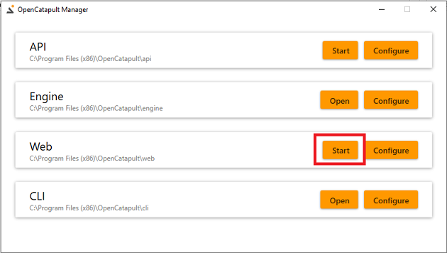

Notice that another command prompt is opened. Please wait until the running script is completed. If you see the following status, it means the Web component has been successfully started on https://localhost:44300

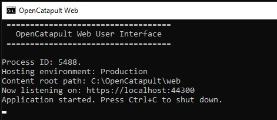

4) You can now open a browser, and go to `https://localhost:44300` to open the `OpenCatapult` Web UI

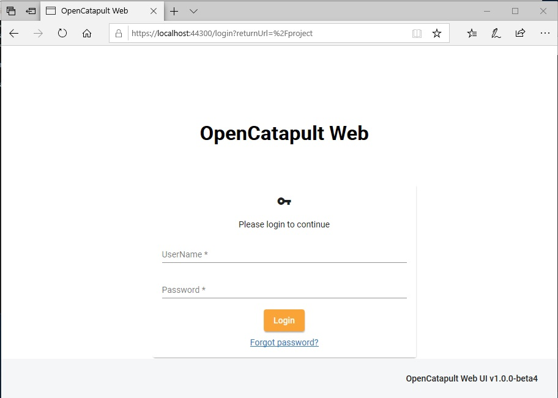

5) In the login page, enter "`admin@opencatapult.net`" as the UserName, and "`opencatapult`" as the Password. If you are able to login, it means the components have been setup correctly.

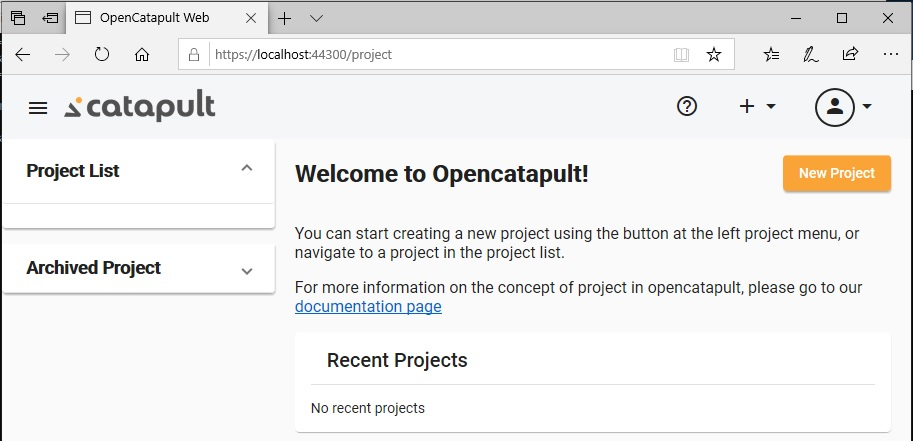

## Next steps

As you have the `OpenCatapult` setup on your machine, you can start to explore more about it.

- [create your first project](../user-guides/create-first-project-web.md)
- [try CLI to manage projects](../user-guides/projects.md)
- [build from source code](../dev-guides/build-code.md)