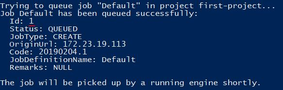

# Quick Start

This document will guide you to get started with `OpenCatapult`.

## Setup from release library

[coming soon]

## Build from source code

### Pre-requisites

- Git (https://git-scm.com/)
- .Net Core 2.1 SDK (https://dotnet.microsoft.com/download/dotnet-core/2.1)
  - `OpenCatapult` requires the LTS version as minimum requirement (which is SDK 2.1.500)
- SQL Server 2017 (https://www.microsoft.com/en-us/sql-server/sql-server-2017)
  - If you want to use local instance, you can use the free `Express` or `Developer` edition
  - You can alo use remote instance (e.g. Azure SQL)
- Node JS (https://nodejs.org)
  - This is required by the Web UI. You can skip this if you go all CLI.
- [Optional] Code editor, e.g. Visual Studio Code (https://code.visualstudio.com/)

### Get the source code

Clone `OpenCatapult` source code from the repository:

```sh
git clone https://github.com/Polyrific-Inc/OpenCatapult.git
```

Go to the root folder:

```sh
cd OpenCatapult
```

From this point you have two options: build the source code using PowerShell scripts, or build manually.

### Option 1: Build using PowerShell scripts

> *Pro tips*: did you know that you can install PowerShell in Mac and Linux? Please check this out: <https://docs.microsoft.com/en-us/powershell/scripting/overview>

When running the scripts, you might get execution policy error. In most of the time it can be fixed by setting the execution policy to `RemoteSigned`:

```powershell
Set-ExecutionPolicy -ExecutionPolicy RemoteSigned
```

Please check the following [article](https://docs.microsoft.com/en-us/powershell/module/microsoft.powershell.core/about/about_execution_policies?view=powershell-6) for more details about execution policies.

#### One script to rule them all

You will need to build the API, Engine, and UI (either CLI or Web) to run `OpenCatapult`. In production scenario, the components are typically installed in separated machines. However, in the development scenario, we will run them all in your local machine. We have prepared a script to help you run the components easier. Run this command in PowerShell:

```powershell
.\builds\build-all.ps1
``` 

> Note that running this script will run all 4 of the components. If you want to skip CLI or Web, you can add the `-noCli` or `-noWeb` option. For example if you want to go all CLI, use the following command instead: `.\builds\build-all.ps1 -noWeb`

The script will ask you to input the connection string for the API. It will also automatically open new PowerShell windows for other components.

> Please don't close the first powershell window since it is being used to run the API, which is being used by Engine, CLI, and Web. To learn more about how opencatapult components relate to each other, please check the following [article](./intro.md#the-components).

If you want to build the API, Engine, CLI, or Web one by one, for example if you want to install them in separate machines, you can run the script for each of the component individually. Please find more details about them in the [Build Scripts](../dev-guides/build-scripts.md) section.


### Option 2: Build from source code manually

If for any reasons you cannot run the PowerShell scripts, you can always build the source code manually. Please go to the [Manually Build The Components](../dev-guides/manual-build.md) section, and go back here when finished.


## Create your first project

> *Note*: The tutorial below is using the opencatapult CLI. If you want to create the project using Web UI, please follow this [link](../user-guides/create-first-project-web.md)

OpenCatapult allows you to define [task providers](../task-providers/task-provider.md) for all types of applications and devOps resources. We have pre-loaded OpenCatapult with an example [code generator provider](../task-providers/generator-provider.md) based on a .NET Core MVC template which will deploy directly to your local machine at this location: `.\publish\engine\working`.

To get started, open up a PowerShell window that will be used as your CLI shell and enter the following from within your OpenCatapult folder:

```sh
cd .\publish\cli\
```

### Login

When you previously applied migrations to initiate the database, a default user was created. You can use this user to login. When you're prompted to enter the password, the default password is `opencatapult`.

```sh
dotnet occli.dll login --user admin@opencatapult.net
```

We strongly advise you to change the default password (or just remove the default user), especially when you deploy the API into public environment:

```sh
dotnet occli.dll account password update
```

### Register and Start the Engine

We need to register Engine so it can communicate with the API without problem. It involves step to register the Engine via CLI, and enter the generated token back in the Engine itself. If you have multiple Engine instances, you need to do this procedure on each of them.

Activate the CLI shell, and enter this command:

```sh
dotnet occli.dll engine register --name Engine001
```

After the Engine is registered, let's generate a token for it, and copy the generated token:

```sh
dotnet occli.dll engine token --name Engine001
```

Activate the Engine shell, go to the engine's published folder, and set the `AuthorizationToken` config with the copied generated token:

```sh
cd .\publish\engine\
dotnet ocengine.dll config set --name AuthorizationToken --value [the-generated-token]
```

Let's start the Engine:

```sh
dotnet ocengine.dll start
```

You can find more details about these procedure at [Manage engine registration](../user-guides/engine-registration.md)

### Create sample project

And now, you're good to go to create a project. We will use `sample` template, which will give you some pre-defined models, and a job definition with a single `Generate` task. The task uses a built-in generator provider called `Polyrific.Catapult.TaskProviders.AspNetCoreMvc`, which will generate a starter ASP.NET Core MVC application.

Activate the CLI shell, and enter this command:

```sh
dotnet occli.dll project create --name first-project --client Polyrific --template sample
```

During the process you will be prompted to enter `Admin Email`. Please fill it with your email.

After the project is created you can check the created elements in it. For example you might want to check the created data models:

```sh
dotnet occli.dll model list -p first-project
```

### Queue the job

As explained in [introduction](./intro.md#the-circle-of-magic), the automation logics happens in the engine. We define what the engine shall do in what we call [job](../user-guides/job-definitions.md). A job can contain many tasks as needed by our development, build, and deployment pipeline. When we want to ask the engine to run a job, we add it into the [queue](../user-guides/job-queues.md), and any active engine will pick it up and execute it.

The project that you've just created contains a `Default` job definition with a `Generate` task in it.

```sh
dotnet occli.dll job get -n Default -p first-project
```

Let's add the job to the queue so Engine can pick and execute it.

```sh
dotnet occli.dll queue add -j Default -p first-project
```

 The above command will print the created queue in the CLI. You should check out the `Id` since this will be used to get the log or queue status. If this is your first time adding queue, the `Id` should be 1.
 


You can monitor the live progress by using the `queue log` command and passing the queue `Id`:

```sh
dotnet occli.dll queue log -n 1 -p first-project
```

The final status of the process can be checked by this command:

```sh
dotnet occli.dll queue get -n 1 -p first-project
```

It will tell you the status of each task execution, whether it's Success or Failed, along with the error remarks if any.

## Next steps

After creating your first project, you can:

- [add models to the project](../user-guides/data-models.md)
- [explore what else you can do with the project](../user-guides/user-guides.md)
- [create another project by using Sample-DevOps project template](../user-guides/sample-project.md)
- check references of [API](../api/api.md), [Engine](../engine/engine.md), [CLI](../cli/cli.md)