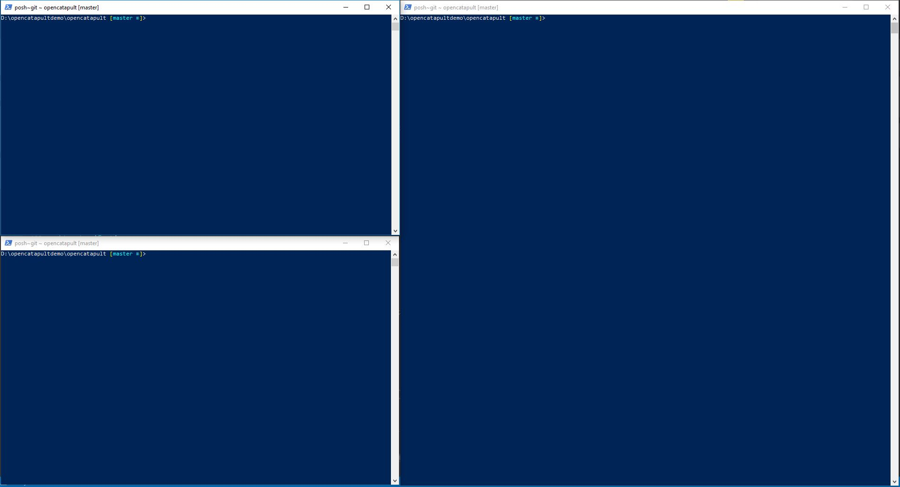

# Build Scripts

## Prepare the powershell windows

If you want to run opencatapult solely on your local machine, you would need three separate powershell windows to build the API, CLI, and Engine:



In production scenario, all three typically installed in separated machine.

#### Run pre-requisites script

This script will check your environment for required tools to build `OpenCatapult` source code:

```powershell
.\builds\build-prerequisites.ps1
```

#### Run API build script

Before running the script, you need to prepare a database, which the connection string needs to be inputted later.

Let's run the script to publish and run the API:

```powershell
.\builds\build-api.ps1
```

By default it will listen to url http://localhost:8005 and https://localhost:44305. If you want to set it to different urls, please use `-http` or `-https` parameter respectively:

```powershell
.\builds\build-api.ps1 -http http://localhost:5000 -https https://localhost:5001
```

If it all succeeded, the API will run in the powershell window. Please don't close this window when you are using the CLI or Engine, since they all depend on the API.

#### Run Engine build script

Open a new PowerShell instance, and run the script to publish the Engine:

```powershell
.\builds\build-engine.ps1
```

#### Run CLI build script

Open a new PowerShell instance, and run the script to publish the CLI:

```powershell
.\builds\build-cli.ps1
```