# Create your first project using Web UI

Let's open the web browser, and go to the `OpenCatapult` Web UI address. If you followed the [Quick Start](../home/start.md), it should be https://localhost:44300.

## Login

If you haven't logged in, please login first by using "`admin@opencatapult.net`" as the username and "`opencatapult`" as the password.

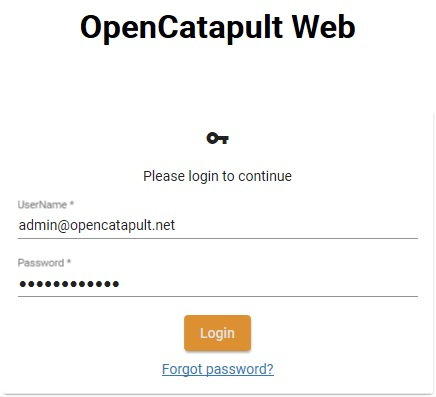

We strongly advise you to change the default password (or just remove the default user), especially when you deploy the API into public environment. You can change the password via User Profile page later.

## Register and Start the Engine

Registering the Engine is not required to create a project actually. It is needed later when we want to queue a job in the project. However, we recommend to do it as part of the setting up `OpenCatapult` for the first time.

Registering the Engine involves two main steps:

1. Register it via Web UI, and generate an access token
2. Enter the generated access token in the Engine config

If you have multiple Engine instances, you need to repeat the steps for each of them.

In the Web UI, select `Engines` from the top navigation menu, and click `Register New Engine` button. You can name your Engine with whatever you want, e.g. `Engine001`.

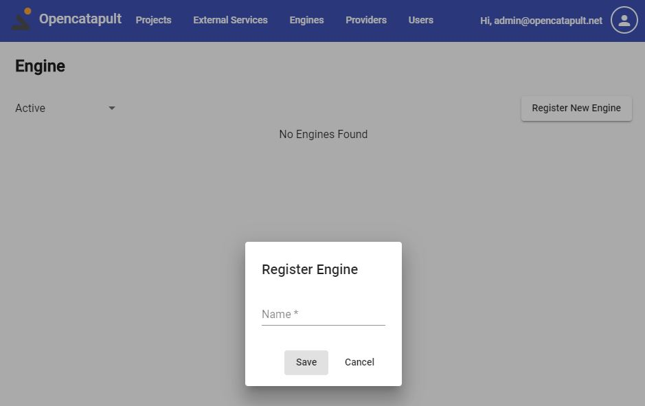

After saving the new Engine, let's generate an access token for it. Please click the key icon in the engine record to open the Engine Token form.

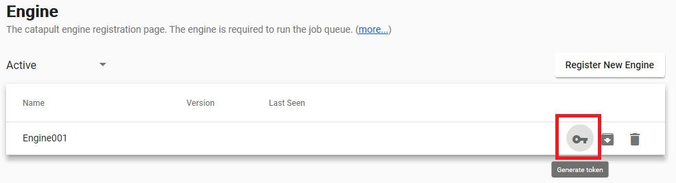

In the Engine Token form, click `Generate` button. Please copy the token by clicking the copy icon.

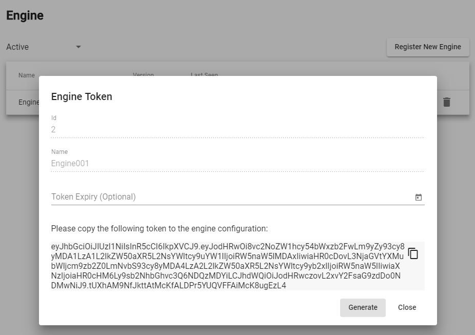

Activate the Engine shell (if you followed the [Quick Start](../home/start.md) it should have been opened for you). Type the following command to enter the access token into the Engine config:

```sh
ocengine config set --name AuthorizationToken --value [the-generated-token]
```

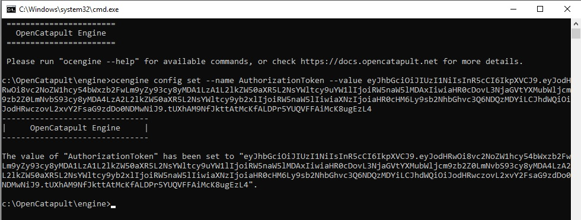

After setting the access token, let's start the Engine by typing the following command:

```sh
ocengine start
```

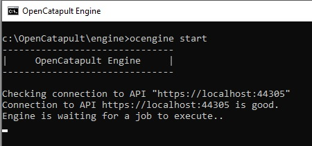

You can find more details about these procedure at [Manage engine registration](../user-guides/engine-registration.md)

## Create sample project

And now, you're good to go to create a project. We will use `sample` project template, which will give you some pre-defined models, and a job definition with a single `Generate` task. The task uses a built-in generator provider called `Polyrific.Catapult.TaskProviders.AspNetCoreMvc`, which will generate a starter ASP.NET Core MVC application.

Select `Projects` from the main navigation menu, and click the `New Project` button to open the new project form.

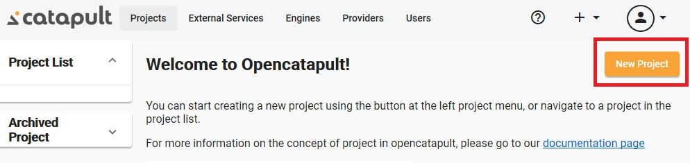

In the new project form, enter the details of the new project.

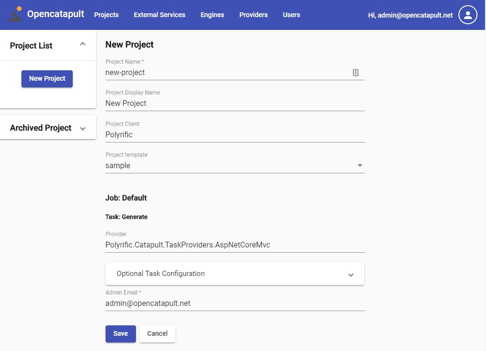

At the bottom of the form you will also find the "Default" job that will be created because you select the `sample` project template. In the "Generate" task, please enter your email which will be used as the Admin user in the generated application later.

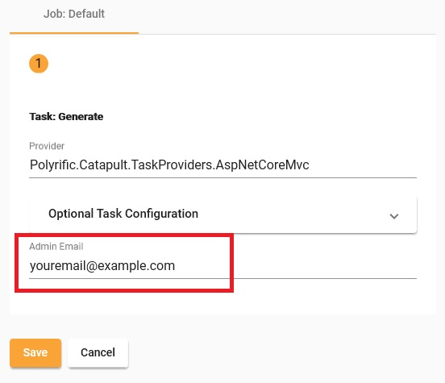

After saving the form, you have completed the process of creating your first project. You can explore the project and see the pre-populated Data Models and the default Job Definition.

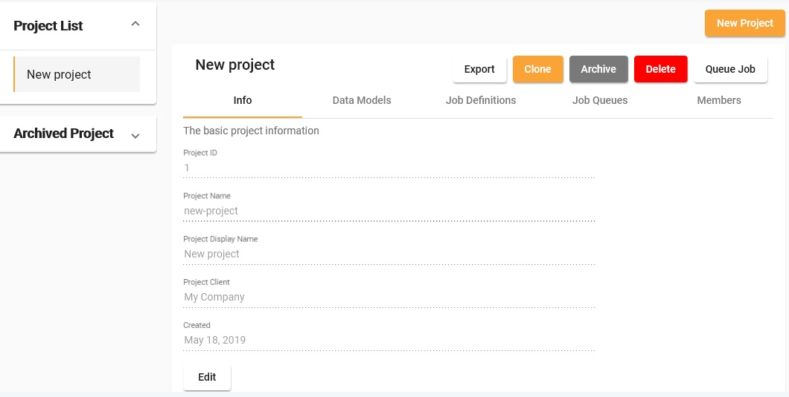

The next step is to make `OpenCatapult` actually generate your application by queueing the default Job Definition. Let's go!

## Queue the job

As explained in the [Introduction](./intro.md#the-circle-of-magic) of this docs, the automation logics happens in the Engine. We define what the Engine should do in a [Job Definition](../user-guides/job-definitions.md). A job can contain one or more tasks as needed by our development process and deployment pipeline. When we want to ask the Engine to run a job, we add it into a [queue](../user-guides/job-queues.md), and any active Engine will automatically pick it up and execute it.

The project that you've just created contains a `Default` Job Definition with a single `Generate` Task in it. You can put the job in the queue by clicking the project's `Queue job` button. Click `Yes` on the confirmation dialog.

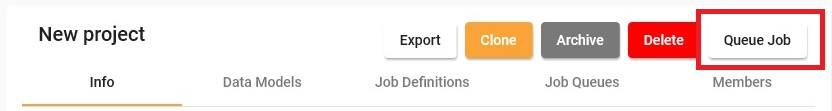

In the `Job Queues` tab, you can see the job is being queued. You can monitor the live progress of the job queue, by clicking the log icon

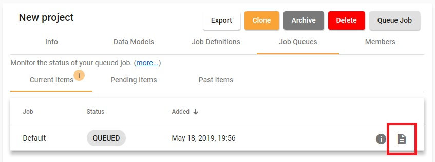

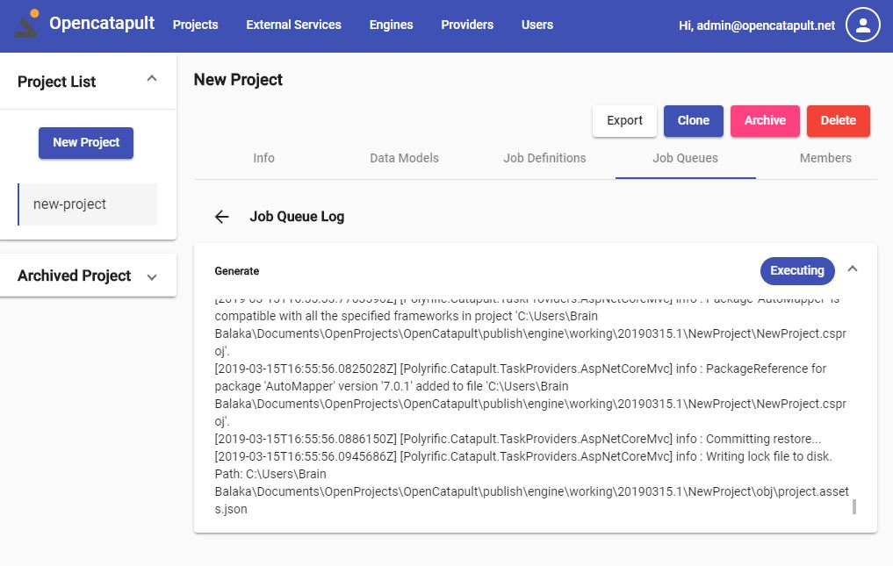

The final status of the process can be checked in the job queue details. Either click the `info` button in the queue, or click `back` from the log page.


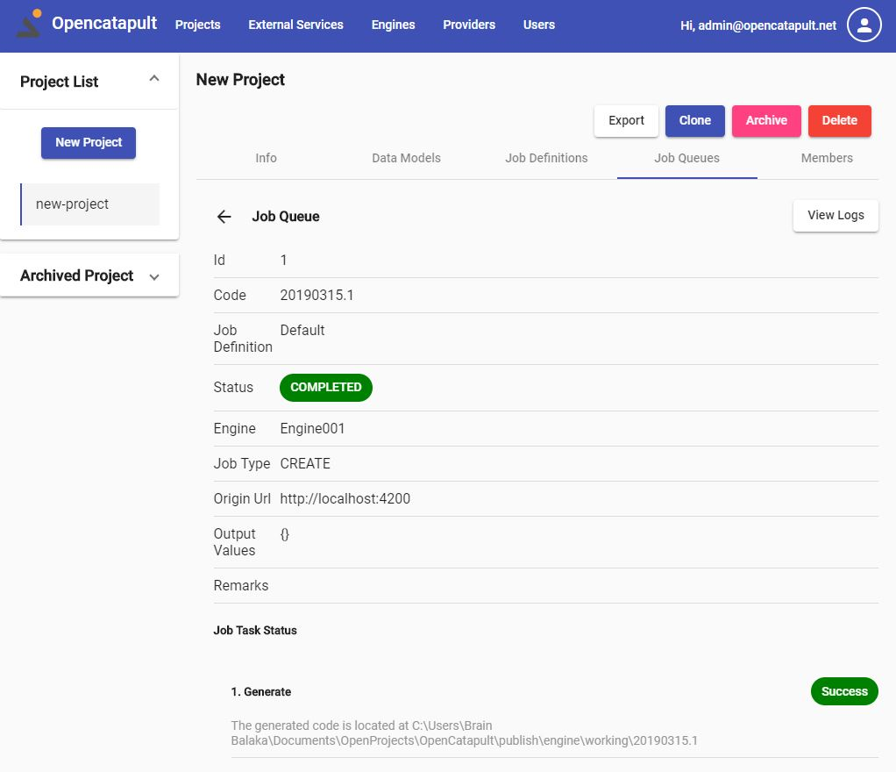


It will tell you the status of each task execution, whether it's Success or Failed, along with the error remarks if any.

And that is it. You can go ahead and check the generated code. The folder location is provided in the task status remarks.