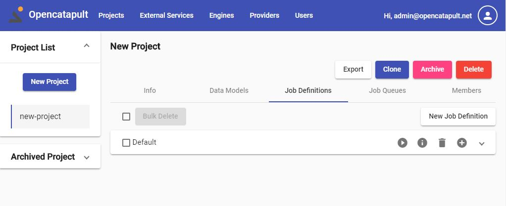

# Create your first project using Web UI

Let's open the web browser, and type the opencatapult web UI address. If you follow how to build the Web UI in the [Quick Start](../home/start.md), it should be https://localhost:44300

## Login

You would be prompted to login. Please use the user `admin@opencatapult.net` and password: `opencatapult`


We strongly advise you to change the default password (or just remove the default user), especially when you deploy the API into public environment. You can change it in the https://localhost:44300/user-profile

## Register and Start the Engine

We need to register Engine so it can communicate with the API without problem. It involves step to register the Engine via CLI, and enter the generated token back in the Engine itself. If you have multiple Engine instances, you need to do this procedure on each of them.

Go to the menu `Engines`, and click `Register New Engine`. Enter the engine name `Engine001`, and click Save.


After the Engine is registered, let's generate a token for it. Please click the key icon in the engine record, and click `Generate`. Please copy the token by clicking the copy icon.


Activate the Engine shell, go to the engine's published folder, and set the `AuthorizationToken` config with the copied generated token:

```sh
cd .\publish\engine\
dotnet ocengine.dll config set --name AuthorizationToken --value [the-generated-token]
```

Let's start the Engine:

```sh
dotnet ocengine.dll start
```

You can find more details about these procedure at [Manage engine registration](../user-guides/engine-registration.md)

## Create sample project

And now, you're good to go to create a project. We will use `sample` template, which will give you some pre-defined models, and a job definition with a single `Generate` task. The task uses a built-in generator provider called `Polyrific.Catapult.TaskProviders.AspNetCoreMvc`, which will generate a starter ASP.NET Core MVC application.

Head up to the new project page, by clicking the `New Project` button at the left hand side of the project Page. Fill the form as below, and click save.


You have created a new project! Let's generate the code for our project!

## Queue the job

As explained in [introduction](./intro.md#the-circle-of-magic), the automation logics happens in the engine. We define what the engine shall do in what we call [job](../user-guides/job-definitions.md). A job can contain many tasks as needed by our development, build, and deployment pipeline. When we want to ask the engine to run a job, we add it into the [queue](../user-guides/job-queues.md), and any active engine will pick it up and execute it.

The project that you've just created contains a `Default` job definition with a `Generate` task in it. Let's add the job to the queue so Engine can pick and execute it.

Go to the `Job Queues` tab, and click the play button of the `Default` job definition


You can monitor the live progress of the job queue, by clicking the log icon


The final status of the process can be checked in the job queue details. Either click the `info` button in the queue, or click `back` from the log page.


It will tell you the status of each task execution, whether it's Success or Failed, along with the error remarks if any.

And that is it. You can go ahead and check the generated code. The folder location is provided in the task status remarks.