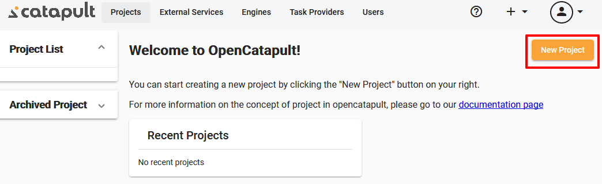
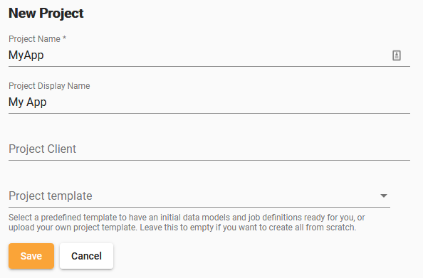

Web UI | [CLI](projects.md)

# Manage projects

In `OpenCatapult` terminology, Project is a unit of work which your team can collaborate to create an application. The structure of the application itself can be adjusted based on your needs. For example, a project can contain an API, an Admin application, and a front-facing customer application.

## Create project

Creating a new project can be done by clicking the "New Project" button on top of the "Project" section.

In the "New Project" form you can define some of the project properties. The only required field is the "Project Name", and it needs to be unique. The "Project Display Name" is automatically filled while you type the "Project Name", although it can be modified again later. You can optionally select the provided Project template or upload a yaml file.

You can find more info about Project template [here](../dev-guides/project-template.md).

## Update project

## Remove project

## Archive project

When you want to remove external services of a project, but don't want to remove the project from the database, you can opt to archive it. The archived project can be [restored](#restore-project) later.

## Restore project

## Clone project

You can clone an existing project, and create a new one. The new project will have the [models](data-models.md) copied from the cloned project. You can optionally copy the [members](project-members.md) and [jobs](job-definitions.md).

## Export project

You can export an existing project into a yaml file, which can be used as a template for other projects later.

The yaml file will be created in the AppData folder. You can also specify a specific location for the template file to be saved.