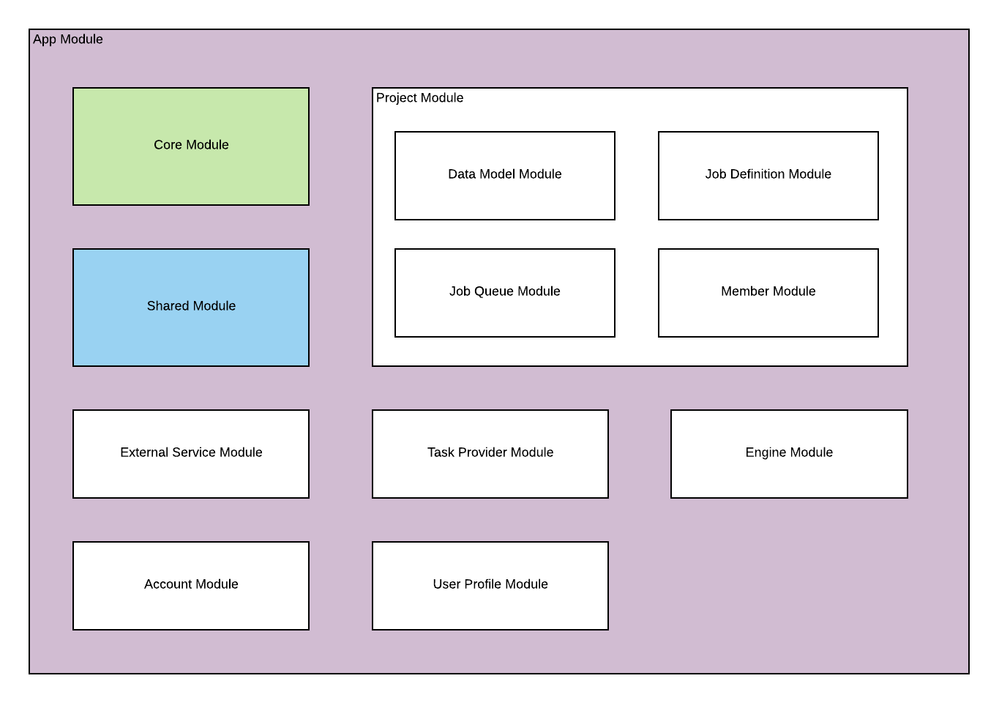

# Web UI

## Architecture

The Web UI is built using [angular 7](https://angular.io). It is composed into modules so that each module focus on the feature  it's trying to provide. The modules are also lazily loaded.

## Modules

The application is composed by several Feature Modules. There are two special modules: Core Module and Shared Module, which contain services, components, or directives which can be used by multiple feature modules. The rest of the modules represent the catapult feature composition. 

### App Module
The root module of the application. It contains the root UI layout of the whole application, as well as generic page, such as login page. It also contains the routing for root application. Each feature module will have its own routing, so the route specified in the root is only for one level.

### Core Module
This module contains core logic that are used throughout application. It contains the Authentication and Authorization logic, as well as services used to connect to the API. This module should only be called in App Module, since the service need to be registered in root of the app (You will get an error if you try to import it anywhere else ;) )

### Shared Module
Shared module contains components, directive, or services that are used by feature module, to increase reusability. You can import it anywhere. But if you import it in the root, remember to use the `forRoot()` method, so the services are also imported.

### Project Module
The Project Module contains the project feature such as listing project, creating new project, and editing the project info. It also contains several child modules:

#### Data Model Module
Data Model module contains UI to manage project's data model.

#### Job Definition Module
Job Definition module contains UI to manage project's job and task definition. We can also queue a job definition here.

#### Job Queue Module
Job Queue module contains UI to manage and monitor the job queue. You can track the status and the log of your running queue, or restarting a pending one.

#### Member Module
Member module contains UI to manage project's member. You can add new member, change the project role, or remove her from a project.

### External Service Module
External service module contains UI to manage external services.

### Task Provider Module
Task provider module contains UI to install or remove a task provider. It can only be accessed by administrator.

### Engine Module
Engine module contains UI to register a new engine, get an authorization token, and manage the engines. It can only be accessed by administrator.

### Account Module
Account module contains UI to manage users. It can only be accessed by administrator.

### User Profile Module
User Profile module contains UI to manage current user's data, such as name and password.

## Technology stack
Aside from angular, we're also using the following 3rd party library:
- [Angular Material](https://material.angular.io). It helps us creating a modern material UI without the need to write additional css.
- [Angular Flex Layout](https://github.com/angular/flex-layout). It helps us creating responsive UI easily.